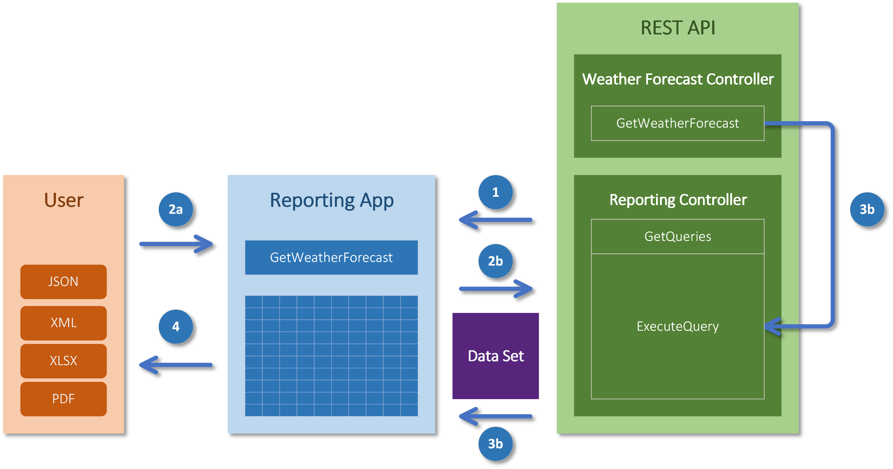
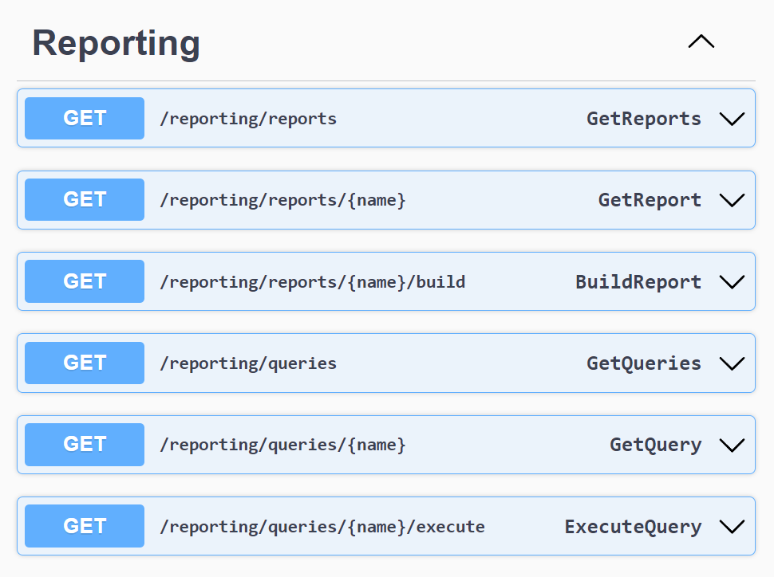
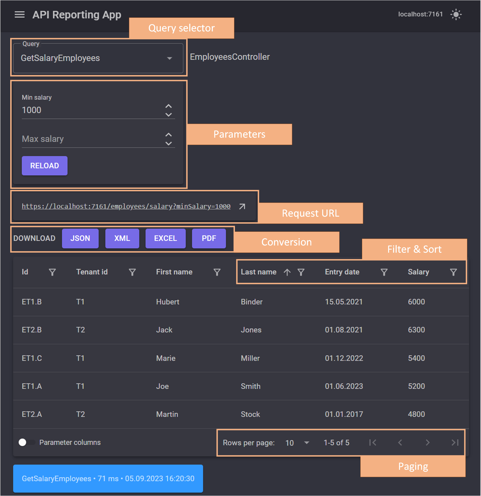
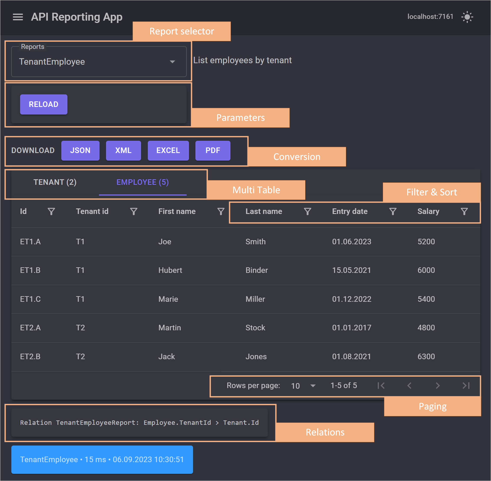

As REST APIs become more centralized sources of information, the need for flexible reporting on REST API data increases. The Reporting API extends an existing REST API so that its data can be analyzed in an easy-to-use reporting tool.

For a project with an extensive REST API, I developed a solution to query the `GET` endpoint data according to a consistent schema.
- The API developer specifies which `GET` endpoints are available for reporting.
- The user can browse, filter, sort, and convert the data to various formats in the UI.
- Complex queries with linked data reports can be implemented in a single report.

The Reporting API includes an endpoint that acts as a proxy between queries and `GET` endpoints. New `GET` endpoints can be evaluated without further customization. A single model schema is provided to ensure that all queries can be accessed through the same endpoint. The Reporting API uses the `ReportDataSet` for this purpose, which is compatible with the ADO.NET [`DataSet`](https://learn.microsoft.com/en-us/dotnet/framework/data/adonet/ado-net-datasets) and can be serialized for transmission.

The following illustration shows the flow of a request to the `GetWeatherForecast` endpoint.
<p align="center">
    
</p>

#### 1. Retrieving the Metadata
In the first step, the API client queries the available `GET` methods with the `GetQueries` endpoint. The return value includes all methods with their query parameters.

#### 2. Entering the Query Parameters
The user defines the query parameters and executes the query using the `ExecuteQuery` reporting endpoint and the parameter with the target method, for example, `GetWeatherForecast`.

#### 3. Executing the Query
DI is used to instantiate the desired controller (`WeatherForecastController`) and execute the `GetWeatherForecast` method. This is done in the [`ControllerContext`](https://learn.microsoft.com/en-us/dotnet/api/system.web.mvc.controllercontext) of the `ExecuteQuery` request to prevent unwanted access. The return value of the method is a list of type `WeatherForecast`, returned as a `ReportingDataSet`.

#### 4. Analyzing the Query Data
The API client application can convert the `ReportingDataSet` to an ADO.NET `DataSet`, which allows for tabular analysis and format conversions.

> 👉 Using Reflection to evaluate data takes longer than using direct object access. Reports that need to process large amounts of data should obtain the data through special services.

### Enabling Reporting on Your REST API
There are three steps to adding reporting to your REST API.

#### Step 1 - NuGet
Install the library using the NuGet package.
```
> dotnet add package RestApiReporting.NET
```

#### Step 2 - Reporting Controller
Add the `ReportingController.cs` file to your API controllers.
```csharp
using RestApiReporting.Service;
public class ReportingController : ReportingControllerBase
{
    public ReportingController(IApiReportingService reportingService) :
        base(reportingService)
    {
    }
}
```

####  Step 3- Reporting Service
Register the reporting service in the DI container.
```csharp
// Program.cs
using RestApiReporting.Service;
...
builder.Services.AddReporting();
...
```

> 👉 If only the query endpoints are to be available, the controller is derived from the `ReportingQueryControllerBase` class and the service is registered with `Builder.Services.AddReportingQuery()`.

Now the REST API includes the reporting controller service and can be started.

#### Customizing the Reporting Service
By default, all GET endpoints are registered as queries. Classes that implement the `IReport` will register as reports.
The behavior can be controlled using `QueryFilter` and `ReportFilter`.
Filtering is controlled at the following levels
- Query: assembly, type and method
- Report: assembly and type

The `ReportingAttribute` and `ReportingIgnoreAttribute` marker attributes provide the ability to include or exclude assemblies, types and methods. Assemblies, types and methods with the `ReportingIgnoreAttribute` are always ignored. The `ReportingAttribute' can be used to control reflection in two ways.

In **Exclude mode** all unwanted endpoints are excluded.
```csharp
builder.Services.AddReporting(
    new QueryFilter(
        methodFilter: method => !method.IsReporting()));
```

In **Include Mode**, only the desired endpoints are captured.
```csharp
builder.Services.AddReporting(
    new QueryFilter(
        typeFilter: type => type.IsReporting()));
```

### Start the REST API
Once the Reporting Controller is registered with the REST API, it can be launched. Here is how to start the included `WebApi` REST API sample.
```shell
dotnet run --project WebApi\WebApi.csproj --urls=https://localhost:7082
```

The Reporting Controller appears in Swagger at the URL `https://localhost:7082`.
<p align="center">
    
</p>

### Reporting Web Application
The Reporting Web Application is a Blazor server application and requires the REST API URL parameter at startup. In the following example, the Reporting Web Application is launched with the URL `https://localhost:8036` and executes the queries and reports via REST with the URL `https://localhost:7082` using the `--api` parameter.
```shell
dotnet run --project %~dp0WebApp\WebApp.csproj --urls=https://localhost:8036 --api=https://localhost:7082
```

After that, the web application can be opened in the browser at `https://localhost:8036` and two pages will appear.
- Query page - execute the REST API query methods
- Report page - build predefined reports

#### Query Page
This page allows you to execute all query methods.
<p align="center">
    
</p>

> Queries always have a single result table. This is also true for GET endpoints, which return a single object.

#### Report Page
The report page allows you to build reports.
<p align="center">
    
</p>

> 👉 Reports can contain data in multiple tables that are related to each other.

#### Customizing the Web Application
The web application settings are defined in the `appsettings.json` file.

| Setting | Description | Default |
|:---|:---|:---:|
| `ApiUrl` | API URL such as https://localhost:7161/ | x |
| `AppTitle` | Application title | system |
| `LayoutMode` | Page layout mode: `ExtraSmall`, `Small`, `Medium`, `Large`, `ExtraLarge` or `ExtraExtraLarge` | `Large` |
| `NameFormat`| Name formatting style: `None`, `PascalSentence` or `CamelSentence` | `PascalSentence` |
| `DenseMode` | Grid dense mode | `false` |
| `DataPageCount`| Grid rows per page | `10` |
| `FilterMode` | Grid filter mode: `Simple`, `Menu`, `Menu`, `Menu`, `Menu` or `Row` | `Simple` |

> 👉 In development mode, it is recommended that you outsource endpoint configuration to [User Secrets](https://learn.microsoft.com/en-us/aspnet/core/security/app-secrets).

### Reports
The report is a C# class that implements the `IReport` interface.
```csharp
public interface IReport
{
    string Name { get; }
    string? Description { get; }
    IList<string>? SupportedCultures { get; }
    IList<ApiMethodParameter>? Parameters { get; }
    Task<ReportResponse> BuildAsync(IApiQueryService queryService, ReportRequest request);
}
```

The report has a name, description, culture information, and report parameters. The report is built using the `BuildAsync` method.

> 👉 The type for the report parameter `ApiMethodParameter` is identical to the method parameter of the query methods.

The following example generates the report for a client and its employees.
```csharp
public class TenantEmployeeReport : IReport
{
    public string Name => "TenantEmployee";
    public string? Description => "Employees by tenant";
    public IList<string>? SupportedCultures => null;
    public IList<ApiMethodParameter>? Parameters => null;

    public async Task<ReportResponse> BuildAsync(
        IApiQueryService queryService, ReportRequest request)
    {
        // tenants
        var tenants = await queryService.QueryAsync(
            new ReportQuery(
                controllerContext: request.ControllerContext,
                methodName: "GetTenants",
                primaryKey: "Id"));
        if (tenants == null)
        {
            return new ReportResponse(request);
        }

        // employees
        var employees = await queryService.QueryAsync(
            new ReportQuery(
                controllerContext: request.ControllerContext,
                methodName: "GetEmployees",
                primaryKey: "Id",
                parameters: request.Parameters));
        if (employees == null)
        {
            return new ReportResponse(request);
        }

        // data set
        var dataSet = new ReportDataSet(nameof(TenantEmployeeReport));
        dataSet.Tables.Add(tenants.ToReportDataTable());
        dataSet.Tables.Add(employees.ToReportDataTable());
        dataSet.Relations.Add(new()
        {
            Name = Name,
            ParentTable = tenants.TableName,
            ParentColumn = "Id",
            ChildTable = employees.TableName,
            ChildColumn = "TenantId"
        });

        return new ReportResponse(dataSet, request);
    }
}
```

The ability to convert generic `IEnumerable` collections to tables allows you to merge the results of queries and custom services into a single dataset.

### Source Code and NuGet
👉 Source code on [GitHub](https://github.com/Giannoudis/RestApiReporting)
👉 Package on [NuGet](https://www.nuget.org/packages/RestApiReporting.NET/)